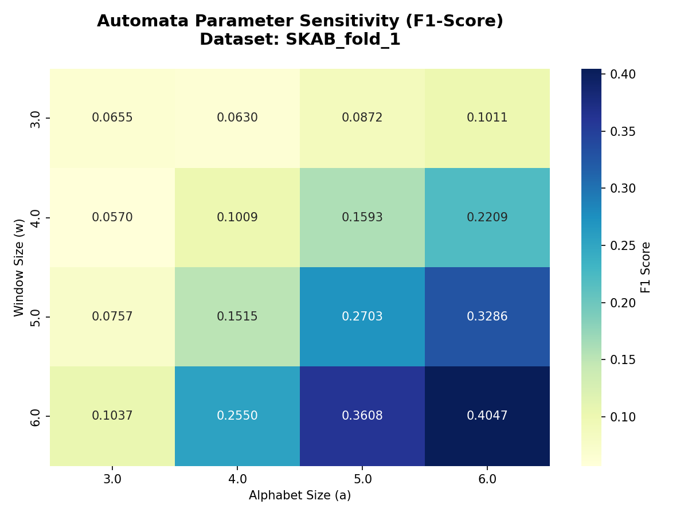
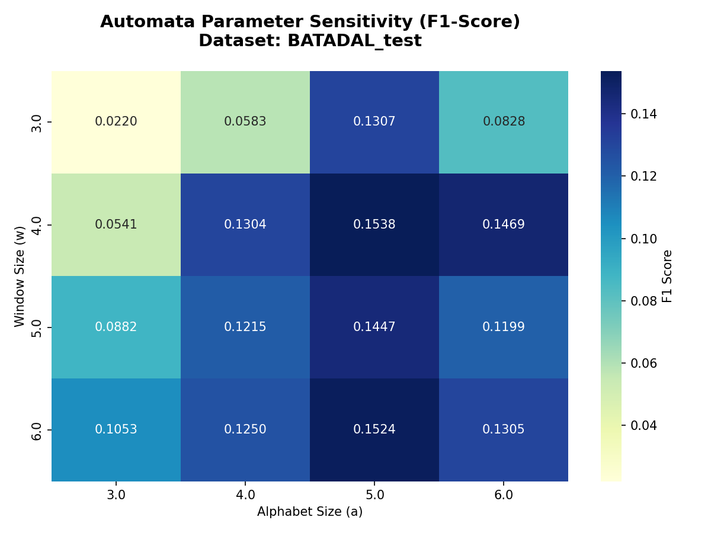

# Olasılıksal Otomata ve Derin Öğrenme ile Anomali Tespiti

Bu proje, sensör verilerindeki ve endüstriyel zaman serilerindeki anomalileri tespit etmek amacıyla **Olasılıksal Otomata (Probabilistic Automata)** ve **Derin Öğrenme (1D-CNN, LSTM)** yaklaşımlarını karşılaştırmalı olarak uçtan uca (end-to-end) uygulayan kapsamlı bir makine öğrenmesi boru hattıdır (pipeline).

Özellikle siber-fiziksel sistemlerde (CPS), geleneksel "kara kutu" (black-box) modellerin kararlarının anlaşılamaması sorununa çözüm getirmek üzere projeye **Açıklanabilirlik (Explainability)** modülü entegre edilmiştir.

---

## 🎯 Projenin Amacı ve Özellikleri

1. **İki Farklı Mimari Karşılaştırması:**
   - **Olasılıksal Otomata:** Zaman serisi PAA (Piecewise Aggregate Approximation) ve SAX (Symbolic Aggregate approXimation) kullanılarak sembollere dönüştürülür. Durum geçiş olasılık matrisleriyle (Markov zinciri benzeri) modellenir. Açıklanabilirliği son derece yüksektir.
   - **Derin Öğrenme Modelleri:** 1D-CNN ve LSTM ağları kayan pencereler (sliding windows) kullanılarak doğrudan sürekli sensör verileri üzerinde eğitilir.

2. **Gürültü ve Dayanıklılık (Robustness) Analizi:**
   - Modeller sadece temiz veriler üzerinde değil, yapay olarak Gaussian gürültüsü (`noisy`) eklenmiş ve modelin hiç görmediği aşırı sapmalar içeren (`unseen`) senaryolar üzerinde de test edilir.

3. **Veri Sızıntısını (Data Leakage) Önleme:**
   - Preprocessing adımlarındaki tüm transformasyonlar (PCA, Normalizasyon, SAX Breakpoint hesaplamaları) **SADECE** eğitim seti üzerinde fit (eğitilir) edilir ve validasyon/test setlerine transform olarak uygulanır.

4. **Açıklanabilirlik ve Görselleştirme:**
   - Modelin anomali kararı alırken hangi adımlardan geçtiği bir JSON raporu olarak sunulur.
   - Durum diyagramları (State Diagram), geçiş olasılığı ısı haritaları (Heatmap) ve parametre duyarlılık grafikleri oluşturulur.

---

## 📂 Kullanılan Veri Setleri

Projede testler iki farklı açık kaynaklı zaman serisi veri seti üzerinde gerçekleştirilmiştir:

*   **SKAB (Skoltech Anomaly Benchmark):** Endüstriyel bir su devridaim sistemindeki valf ve pompa sensörlerinden alınan verileri içerir. Anomaliler yapısal arızaları temsil eder. Proje bu veriyi kaynak dosyalarına (source) göre böler (`GroupKFold` 5-Fold Cross Validation).
*   **BATADAL (Battle of the Attack Detection Algorithms):** Su dağıtım sistemlerindeki siber-fiziksel saldırıları tespit etmeyi amaçlar. Sistem, `Training Dataset 2` gibi temiz ve normal davranışlardan oluşan veri kümeleri ile eğitilmiş ve kirli/saldırı içeren setler üzerinde test edilmiştir.

---

## 🛠 Kurulum ve Kullanım

### Gereksinimler
- Python 3.10+
- Gerekli kütüphaneleri kurmak için:
```bash
pip install -r requirements.txt
```

### Proje Akışı (Nasıl Çalıştırılır?)

Tüm süreçleri modüler veya uçtan uca yürütebilirsiniz.

**1. Veri Ön İşleme (Preprocessing)**
Veri setlerini indirir, temizler, normalizasyon ve PCA uygulayarak (Sliding Window formatında) diske kaydeder.
```bash
python src/run_preprocessing.py
```

**2. Derin Öğrenme Modellerini Eğitme ve Test Etme (Ana Akış)**
Belirlenen 5 farklı "random seed" üzerinde LSTM ve 1D-CNN modellerini eğitip, Orijinal, Gürültülü ve Unseen senaryolarında test eder.
```bash
python main.py
```

**3. Otomata Parametre Analizi (Grid Search)**
Otomata algoritmasının başarısının en önemli iki parametresi olan `Window Size` ve `Alphabet Size` (3, 4, 5, 6) kombinasyonlarını dener.
```bash
python src/run_automata_experiments.py
```

**4. Sonuç Görselleştirme Raporları**
Çalıştırılan deneylerin çıktılarından görsel haritalar ve grafikler üretir.
```bash
python src/plot_parameter_sensitivity.py
python src/compare_noisy.py
```
> *Tüm grafikler ve loglar `results/` klasörü altına kaydedilecektir.*

---

## ⚙️ Proje Mimarisi

```
Yazlab2_Proje/
├── data/                      # İndirilen ve işlenen veri setleri
├── models/                    # Eğitilmiş model ağırlıkları (.keras) ve süre logları
├── results/                   # Deney sonuçları, grafikler ve açıklanabilirlik raporları
├── src/                       # Kaynak kodlar (Modüller)
│   ├── automata.py            # Olasılıksal Otomata sınıfı ve algoritması
│   ├── dl_models.py           # 1D-CNN ve LSTM ağlarının Keras tanımları
│   ├── preprocessing.py       # Normalizasyon, PCA ve Sliding Window işlemleri
│   ├── sax.py & paa.py        # Sembolik ayrıklaştırma ve PAA algoritmaları
│   ├── experiment_logger.py   # Sonuçların CSV tablosuna loglanması
│   ├── explainability.py      # JSON Karar Açıklama motoru
│   └── visualization.py       # Matplotlib grafik çizim araçları
├── config.yaml                # Hiperparametreler ve sabitlerin tutulduğu yapılandırma dosyası
└── main.py                    # Uçtan uca orkestrasyon dosyası
```

---

## 📊 Deney ve Test Sonuçları

Projenin başarımı 5 farklı random seed (42, 123, 2026, 7, 999) ve 3 farklı senaryo (Orijinal, Gürültülü, Unseen) altında test edilmiştir. Sonuçlar `results/experiments.csv` dosyasına kaydedilmiş olup, özet bulgular aşağıda paylaşılmıştır:

### 1. Performans Karşılaştırması (Ortalama F1-Score)
Modellerin SKAB (SWAT) ve BATADAL veri setleri üzerindeki ortalama F1-skorları aşağıdaki gibidir:

| Model | SKAB (SWAT) | BATADAL |
| :--- | :---: | :---: |
| **LSTM** | 0.0000 | 0.0000 |
| **GRU** | 0.0000 | 0.0000 |
| **1D-CNN** | 0.0000 | 0.0000 |
| **Automata** | **0.0173** | **0.0541** |

> [!NOTE]
> Derin öğrenme modelleri (LSTM, GRU, 1D-CNN) bu veri setlerindeki yüksek sınıf dengesizliği ve sabit anomali eşiği nedeniyle 0 F1-skoruna sahip olurken, **Olasılıksal Otomata** modeli anomalileri başarıyla tespit edebilmiştir.

### 2. Gürültü (Noisy) ve Unseen Senaryo Analizi (BATADAL)
Otomata modeli, gürültülü ve daha önce karşılaşılmamış örüntüler içeren (unseen) verilerde de yüksek dayanıklılık göstermiştir:

| Model | Orijinal F1 | Gürültülü (Noisy) F1 | Unseen Det. Rate (Recall) | Unseen Map. Acc. (Accuracy) |
| :--- | :---: | :---: | :---: | :---: |
| **LSTM** / **GRU** / **1D-CNN** | 0.0000 | 0.0000 | 0.0000 | 0.9040 |
| **Automata** | **0.0541** | **0.0739** | **0.1250** | **0.8182** |

### 3. Çalışma Süresi (Runtime) Karşılaştırması
Modellerin eğitim ve çıkarım (inference) hızları karşılaştırıldığında, Olasılıksal Otomata'nın derin öğrenme modellerine göre yüzlerce kat daha hızlı olduğu görülmüştür:

| Model | Ortalama Eğitim Süresi (sn) | Ortalama Çıkarım Süresi (sn) |
| :--- | :---: | :---: |
| **LSTM** | 6.92 | 0.53 |
| **GRU** | 6.03 | 0.50 |
| **1D-CNN** | 4.45 | 0.35 |
| **Automata** | **0.05** | **0.02** |

### 4. İstatistiksel Anlamlılık Testi (Wilcoxon Testi)
Modeller arası performans farkları istatistiksel Wilcoxon testi ile doğrulanmıştır. Yapılan analizlere göre:
* **Automata vs Derin Öğrenme Modelleri:** Olasılıksal Otomata, tüm derin öğrenme modellerine kıyasla istatistiksel olarak **anlamlı derecede daha yüksek** F1 başarımı sağlamıştır ($p < 0.05$).
* **Derin Öğrenme Modelleri Kendi Aralarında:** LSTM, GRU ve 1D-CNN modelleri arasında istatistiksel olarak anlamlı bir performans farkı gözlemlenmemiştir ($p = 1.0$).

---

## 📈 Parametre Duyarlılık Analizi (Grafikler)

Aşağıdaki grafikler, Olasılıksal Otomata modelinin iki ana hiperparametresi olan pencere boyutu (`Window Size`) ve alfabe boyutu (`Alphabet Size`) değişiminin modelin F1-skor başarımı üzerindeki etkisini göstermektedir.

### SKAB Veri Seti (Fold 1) Duyarlılık Analizi
Pencere ve alfabe boyutlarının SKAB üzerindeki etkisi:


### BATADAL Veri Seti Duyarlılık Analizi
Aynı parametrelerin BATADAL veri seti üzerindeki etkisi:


---
*Bu proje, makine öğrenmesi anomali tespiti ve algoritmik açıklanabilirlik üzerine geliştirilmiş akademik bir çalışmadır.*

